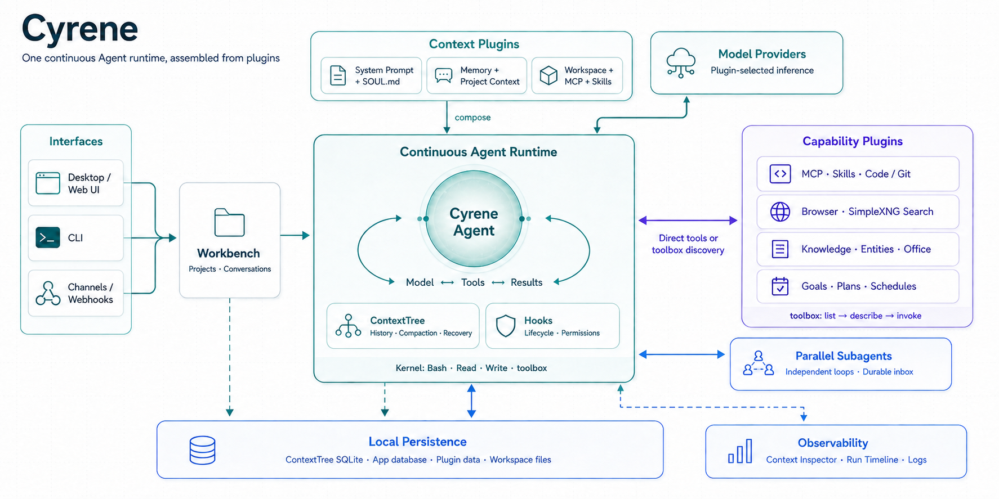

<p align="center">
  
  
  
  
</p>

<p align="center">
  
</p>

<h1 align="center">Cyrene — AI Agent That Evolves</h1>

<p align="center"><strong>English</strong> · <a href="README.zh-CN.md">简体中文</a></p>

<p align="center">
  An open-source, local-first AI agent with durable memory, parallel subagents,
  project workspaces, and a Workbench desktop UI.
</p>

## What Cyrene can do

- **An agent that grows with you** — Cyrene carries its personality and useful
  memories across sessions, while keeping every project's context cleanly
  isolated.
- **Context that flows with the work** — Cyrene composes traceable, shareable
  context blocks: project goals and outcomes flow across tasks, chat histories
  stay isolated, and tasks and subagents receive only the plans, memory, and
  execution state they need. Stable blocks remain reusable, and the full
  composition stays inspectable.
- **From conversation to verified results** — Cyrene can plan, browse, edit
  files, run shell and Git operations, connect MCP servers, use skills, delegate
  to parallel subagents, verify the result, and resume interrupted work.
- **Research you can trace and reuse** — Cyrene combines cited web research with
  your PDFs, Office files, media, and literature library, then turns the evidence
  into structured knowledge or polished PDF reports.
- **A browser the agent can actually operate** — watch Cyrene navigate, click,
  type, upload, and inspect pages in a live view. When login, CAPTCHA, or 2FA
  needs you, take over the same browser and hand it back without losing the
  session.
- **Live PowerPoint composition** — a local Office add-in lets Cyrene inspect,
  batch-create, move, resize, style, render, and verify elements in the open
  presentation while the user watches each slide change progressively.
- **An agent that can manage itself** — through permissioned, auditable tools,
  Cyrene can inspect and operate its own UI, adjust settings, manage projects and
  chats, back up data, and handle updates.
- **A workspace for long-running thinking** — projects bring chats, tasks,
  memories, knowledge, entities, schedules, and literature together in one
  Workbench, available in both the browser and desktop app.
- **Automation that keeps working** — schedule one-shot or recurring tasks and
  receive results through desktop, Telegram, or WeChat notifications.

## One Agent, assembled from plugins

Cyrene is not a fixed agent with a separate extension layer. The running Agent
is assembled from the plugins enabled for that conversation:

```text
empty ContextTree root
  + editable system-prompt plugin
  + SOUL personality plugin (when enabled)
  + memory, project, runtime, and composer-context plugins
  + model provider plugin
  + directly visible tools and discoverable tool plugins
  + lifecycle, permission, learning, and delivery Hooks
  = the Agent for this run
```

At the start of a conversation, tree-local `SessionStart` Hooks freeze the
stable system prompt, SOUL, memory, and learned-skill prefix. Each `TurnStart`
then appends only the workspace, MCP servers, attachments, runtime state, and
other context selected for that turn. Stable bytes always lead the changing
suffix so provider prompt caches can reuse the longest possible prefix.

The model receives only the fixed kernel tools plus tools marked **directly
visible**. Every other enabled toolbox or standalone tool remains available
through `toolbox.list → toolbox.describe → toolbox.invoke`. Before and after a
call, tree-local Hooks can validate or modify arguments, request permission,
record learning evidence, and publish results. `SessionEnd` and `Stop` Hooks
then finalize or cancel plugin-owned work. The ContextTree persists the exact
messages, mounts, tool results, token usage, compaction checkpoints, and inbox
state needed for recovery.

Subagents use the same composition model: each starts from the main Agent's
initial tree plus its assignment, gets capabilities according to its actor
policy, and communicates through the durable inbox. Plugin Center controls
which packs exist, whether individual tools are direct or discoverable, and
their user-edited names and Agent-facing descriptions.

See [Architecture](docs/architecture.md) for the full lifecycle and
[Custom plugins](docs/project-plugins.md) for the contribution formats.

## Quick start

### Desktop app

Download an artifact from
[GitHub Releases](https://github.com/Yongchu-Yitao/Cyrene/releases).

### From source

Requires Python 3.12+, `uv`, and Node.js 22.12+.

```bash
uv sync

cd src/webui
npm install
npm run build
cd ../..

uv run cyrene
```

Open `http://localhost:4242`. First run guides you through model and personality
setup.

To launch the Electron app:

```bash
cd electron
npm install
npm run dev
```

Workbench backend and terminal client commands:

```bash
uv run cyrene
uv run cyrene chat
uv run cyrene status
```

Bare `cyrene` starts the Workbench backend with the new agent runtime.
`cyrene chat` provides streaming replies, tool and plan progress, permission
prompts, attachments, conversation switching, interruption, and run resume.
For scripts, use `cyrene chat --json "your task"`.

For platform setup, optional browser support, channels, and development tests,
see [Installation](docs/installation.md) and
[Development](docs/development.md).

## Documentation

- [Installation](docs/installation.md)
- [Usage](docs/usage.md)
- [Live PowerPoint control (简体中文)](docs/office-live-control.zh-CN.md)
- [Configuration](docs/configuration.md)
- [Architecture](docs/architecture.md)
- [Custom plugins](docs/project-plugins.md)
- [Development](docs/development.md)
- [Current limitations](docs/limitations.md)
- [Development status](project-notes/README.md)
- [Changelog](CHANGELOG.en.md)

## License

[Apache License 2.0](LICENSE)
