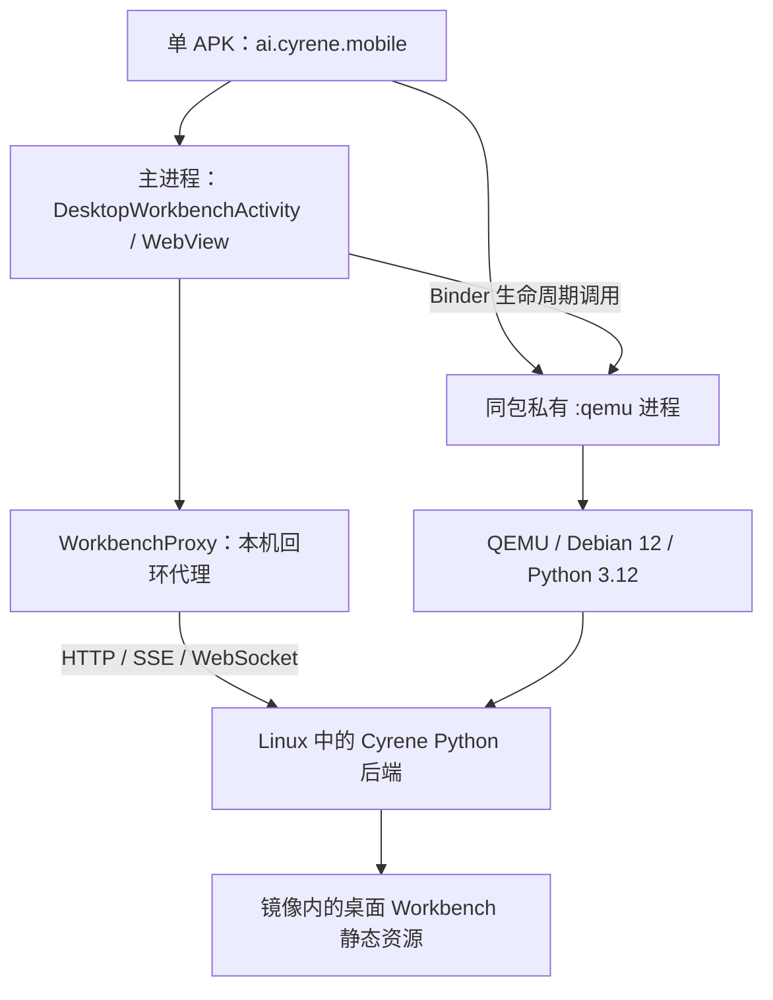

# Cyrene Android 移植与响应式 Workbench 总结

更新时间：2026-09-10。

## 当前成果

Android 已能通过一个 APK 启动内置 ARM64 Linux 运行时和 Cyrene Python 后端，
在 WebView 中使用现有桌面 Workbench。移动端复用同一套业务组件，以响应式布局
调整顶栏、左右卡片、键盘避让和触摸交互。旧 Android legacy 主界面已移除。

这完成了单包启动链路与移动端界面接入，不代表所有桌面能力已在 Android 完整验收。
iOS 在本轮没有实现或交付安装包，不能将 Android 结果视为 iOS 可用的证明。

代码已先提交并推送到两个仓库的 main，再编写本总结：

| 仓库 | 实现提交 | 内容 |
| --- | --- | --- |
| [Cyrene](https://github.com/Yongchu-Yitao/Cyrene) | [e349c1f2](https://github.com/Yongchu-Yitao/Cyrene/commit/e349c1f2) | 响应式 Workbench、手势、顶栏与浮动菜单，以及已有后台投影和模型探测改动 |
| [Cyrene-mobile](https://github.com/Yongchu-Yitao/Cyrene-mobile) | [da19883](https://github.com/Yongchu-Yitao/Cyrene-mobile/commit/da19883) | WebView 接入、ARM64 桌面镜像、单 APK、运行时协议、测试与构建工具 |

## 最终架构



- `runtime-app` 从 Android application 改为 library，由 `app` 依赖；模块名称保留。
- 运行时服务属于主 APK，`exported=false`，通过当前包名绑定，不再寻找另一个 Runtime 包。
- 引擎仍在独立 `:qemu` 进程运行，主应用的 UI 初始化跳过该进程。
- APK 包含 JNI、签名镜像、内核与固件；启动时校验签名和文件摘要，再解压模板并建立可写盘。
- WebView 使用回环代理会话；后端凭据由代理加入请求，不交给页面 JavaScript。
- 前台服务维持运行时生命周期；后台持续运行、系统回收与 OEM 行为仍需真机验收。

ARM64 描述的是客体及引擎架构。当前引擎使用 QEMU 5.1.0 / TCG 软件模拟，
并未因为手机和客体都是 ARM64 就获得 KVM 硬件加速。

## 移动端 UI 的最终行为

### 中间工作区与左右卡片

默认只显示中间工作区，左右原有组件保留挂载，通过覆盖式滑入显示。
左侧整合原目录和模块 Dock，右侧复用当前模块的上下文、详情或右列。
切换模块会关闭卡片，不把移动端展开状态写回桌面侧栏偏好。

左右边缘向内水平滑动打开对应卡片；卡片内反向滑动收起。
支持触摸、鼠标拖动及触控板水平滚动。输入框、终端、代码和横向滚动容器保留自身交互。
普通界面不再显示新增的“左侧卡片”“右侧卡片”“滑动收起”等按钮；键盘辅助入口仅在聚焦时显示。

当前手势超过阈值后播放动画，尚不是逐帧跟手拖动。
隐藏卡片和被覆盖的主内容使用 inert，提供焦点管理、Escape 与减少动画支持。

### 顶栏

窄屏只整合顶栏内部功能，不把标签中心移入左右卡片：

| 入口 | 行为 |
| --- | --- |
| 当前项目名称 ▾（默认项目为 Cyrene） | 打开项目切换菜单 |
| 当前对话或标签标题 ▾ | 展开现有标签中心，包含全部标签并保留状态分组 |
| ⋯ | 展示顶栏其他按钮 |

“⋯”中隐藏主题切换项，其余按钮保持单行，图标占位和文字行高度统一。
可用按钮较多时允许横向滚动。桌面端保留原标签栏及主题按钮。

### 项目操作浮层

最终方案为独立浮动菜单，取消曾经采用的项目行内展开方案。
`ProjectActionPopover` 通过 React portal 挂载到 body，使用 fixed 定位，测量真实尺寸，
根据按钮附近可用空间选择方向，并约束在 visualViewport 内。
滚动、窗口尺寸与可视视口变化时重新定位。展开不改变项目列表尺寸。
Escape 先关闭子菜单并返回触发按钮，项目列表保持打开。

## 已解决的问题与原因

| 问题 | 原因 | 修复 |
| --- | --- | --- |
| 滑动不触发 | 边缘区域太窄，且原实现排除了鼠标输入 | 扩大至 48 CSS px，补充鼠标拖动，保留触摸与触控板路径 |
| passive listener 警告 | React passive wheel 监听中调用 preventDefault | 使用原生非 passive wheel 监听，并正确解绑及更新闭包 |
| 键盘遮住输入框 | 根布局只处理系统栏，没有处理 IME inset | 根据系统栏和 IME 下边距调整 WebView 可用高度 |
| 出现浮动手写面板 | 模拟器 Gboard 手写设置 | 模拟器设为普通键盘；不能声称仅 WebView 配置便解决所有输入法问题 |
| 启动出现后端调试按钮 | 实验阶段原生启动控制页暴露给用户 | 改为品牌加载页、自动进入 Workbench，异常时提供重试 |
| 菜单修复后仍被裁切 | 移动 CSS 链接没有构建版本，实际页面仍加载旧样式 | 加入与其他资源一致的内容指纹查询参数 |
| 项目列表被撑大 | 临时采用了内联子菜单 | 改为 body portal 浮层，脱离父菜单滚动裁切区域 |
| 单行按钮文字不齐 | 头像高于普通图标，挤低标签 | 统一图标轨道和文字轨道 |

缓存问题暴露了之前验证方式的不足：临时注入新样式可以检查布局，却不能证明实际页面
已加载正确版本。最终浮层验收使用正常刷新后的实际 WebView，没有注入样式或拦截资源。

## 验证证据与范围

| 验证项 | 结果与边界 |
| --- | --- |
| 0.3.0 全新单包安装 | 新建 Android 35 / ARM64 / 8 GB RAM / 32 GB 数据分区模拟器，仅安装主 APK；没有旧 Runtime 包 |
| 单包启动 | 主进程与同包 :qemu 进程启动，后端 ready，`/api/health` 返回 200，进入全新模型与人格初始化页 |
| 首次启动成本 | 本机软件模拟环境约 6 分钟；系统原占用不足 1 GB，安装解压后 /data 约 13 GB，不代表手机性能 |
| 模型聊天 | 此前旧实验环境已使用用户指定的远端 Gemma4 接口验证；全新单包环境未重复真实模型调用 |
| 键盘 | 实际 ADB 点按软键盘产生文字；WebView 高度 842→530 CSS px，输入框可见 |
| 卡片手势 | 实际 Android 左右滑动及反向收起、WebView 鼠标拖动通过 |
| 顶栏 | 窄屏打开三个入口；宽屏恢复桌面标签栏 |
| 最终浮层 | 展开前后父菜单高度均 111.52px；三项操作均通过 elementFromPoint 遮挡检查；375×240 和 1280×842 边界检查通过 |
| 0.3.1 APK | 构建、镜像回读及 APK 签名校验通过；没有重新执行全新安装验收，UI 同版本已在现有 QEMU 环境正常刷新验证 |

推送前集中执行了相关测试，未运行全套测试：

- Python：后台投影与模型探测预算，7 项通过。
- Android App：ConversationTimeline、GoldenContract、WorkbenchProxy，10 项通过。
- Runtime：SparseDisk、DesktopBackendEndpoint，4 项通过。
- 实现阶段还运行过手势方向、原生 wheel、前端构建和实际 WebView 检查；这些不等于所有模块完整验收。

本地记录见移动端 `build/push-verification.log`、`build/unified-build.log`、
`build/unified-floating-repackage.log` 以及两个仓库的相关 project-notes。

## APK 与复现方式

最新本地产物：`Cyrene-mobile/dist/Cyrene-Mobile-0.3.1-unified-debug.apk`。

- 大小：1,883,118,062 字节，约 1.88 GB。
- SHA-256：`da3baee88a06b6085835df3a0f7a25106758d72db342b924eac14f8e26a176cb`。
- 开发签名实验包；没有发布 GitHub Release 或商店版本。
- APK、签名私钥、镜像产物、运行数据、临时浏览器日志未提交 Git。
- Git 中包含源码、测试、构建脚本、文档以及运行时所需的 JNI 二进制文件。

在 Cyrene 仓库构建前端：

```sh
npm --prefix src/cyrene/workbench/webui run build
```

在 Cyrene-mobile 仓库生成签名桌面镜像，再构建单包：

```sh
# 新输出目录；签名私钥由构建者自行保管。
python3 runtime-image/desktop/build.py \
  --arch arm64 --source ../Cyrene \
  --output "$PWD/build/unified-assets" \
  --signing-key /absolute/path/to/image-signing-key.pem

JAVA_HOME=/path/to/jdk17 ./gradlew :app:assembleDebug \
  -Dorg.gradle.jvmargs=-Xmx6g --max-workers=2 --no-daemon
```

完整镜像生成需要 Linux Docker 构建环境及依赖下载。也可使用 `refresh-webui.py` 在经过
签名和摘要校验的干净 ARM64 模板上更新静态前端；它会逐文件回读验证并生成新的签名版本，
不读取设备数据盘。构建默认使用 `build/unified-assets`，也可用 `-PcyreneDesktopAssets` 指定目录。
缺失桌面镜像时明确失败，不退回旧 Alpine 镜像。具体要求见
[移动端镜像构建说明](https://github.com/Yongchu-Yitao/Cyrene-mobile/blob/main/runtime-image/desktop/README.md)。

大镜像增量替换曾导致 APK 内部留下无用 ZIP 空间；最终产物通过重新生成 packageDebug
输出恢复到约 1.88 GB。交付前应检查实际文件大小和签名，不能只看压缩资源大小。

## 尚未完成与后续优先级

1. **数据迁移和更新。** 镜像版本变化仍建立新的可写盘，旧双包或旧镜像数据不自动迁移。
   旧数据没有自动删除。需要先定义数据目录与迁移协议，再完善升级流程。
2. **运行时稳定性。** 此前完整 MCP/Chromium 联合探测存在原生 SIGILL；重复启动、退出和
   故障恢复需继续验收。单 APK 打包没有自动解决这些问题。
3. **体积、存储和启动。** 当前保留压缩包、模板与可写盘，空间成本高；建议真机测试留有
   超过最低占用的余量。依赖裁剪、模板管理、静态资源加载和启动流程都可进一步优化。
4. **真机输入与生命周期。** 仍需验证中文输入法、Mac 硬件键盘转发、系统返回手势、旋转、
   长对话、后台运行及不同 OEM 限制。本轮重点为本地 8 GB 模拟器，不是完整真机性能测试。
5. **完整移动能力。** 原生文件、音频及部分桌面宿主集成需要继续补齐；各复杂模块的响应式
   适配和交互需要逐项验收。
6. **iOS。** 尚未交付实现；运行时、平台约束和发行方式仍需独立研究与验证。

本次 push 还包含工作区已有的日程/后台投影、模型探测预算和 Android 模型配置等改动。
它们已按“所有内容”的要求一并提交；不要把这些改动都归因于菜单修复，也不要把本总结中的
移动端验证扩展为对全部已有改动的全功能保证。
